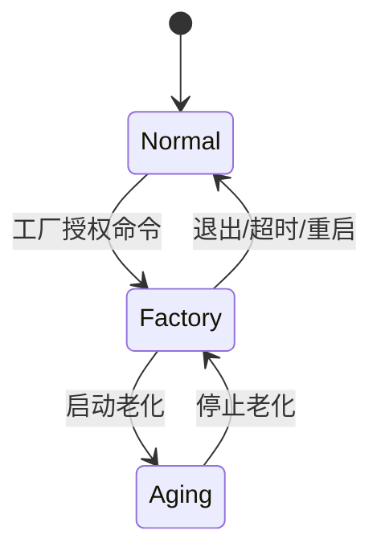

# Application 开发指南

返回：[工程文档总入口](about.md)

本文档说明 `Application` 层如何编写。Application 是应用入口和流程编排层，负责“当前系统处在什么模式、这一轮主循环要调度哪些系统能力”，不负责硬件细节和业务算法本身。

## 1. 定位

推荐边界：

```text
main.c -> Application -> Service
```

一句话：

```text
Application 决定当前模式要做什么，Service 决定系统规则怎么执行。
```

适合放在 Application：

- `app`：固件应用入口，提供 `app_Init()` / `app_MainLoop()`。
- `app_mode`：Normal、Factory、Aging 模式切换。
- `app_normal`：正常运行流程。
- `app_factory`：工厂写参、校准、单通道测试流程。
- `app_aging`：老化测试流程和统计读取流程。
- `app_guardian`：应用级守护、故障保持、喂狗条件和降级策略。
- `app_version`：固件只读版本信息。

不放在 Application：

- 协议帧解析和寄存器映射，这些放 `svc_protocol`。
- 参数结构、CRC、EEPROM 双副本，这些放 `svc_param`。
- 距离/速度/步数换算、阀门模型、运动状态机，这些放 `svc_motion`。
- 急停、错位重走、故障码判定，这些放 `svc_safety`。
- EEPROM、电机驱动、传感器、RS485 适配，这些放 `Module`。
- GPIO、TIM、PWM、USART、LL/HAL 调用，这些放 `BSP`。

## 2. 目录结构

初期推荐保持少量文件，避免 Application 变成新的大杂烩：

```text
Application/
  Inc/
    app.h
    app_mode.h
    app_normal.h
    app_factory.h
    app_aging.h
    app_guardian.h
    app_version.h.in
  Src/
    app.c
    app_mode.c
    app_normal.c
    app_factory.c
    app_aging.c
    app_guardian.c
    app_version.c
  CMakeLists.txt
```

如果初期功能还少，可以先只保留：

```text
app.c
app_mode.c
app_guardian.c
app_version.c
```

Normal、Factory、Aging 的文件等模式逻辑实际膨胀后再拆。

## 3. 头文件规则

Application 公共头文件允许包含：

```c
#include <stdint.h>
#include <stdbool.h>
#include "svc_status.h"
```

Application 源文件可以包含 Service 头文件：

```c
#include "svc_system.h"
#include "svc_protocol.h"
#include "svc_param.h"
#include "svc_motion.h"
#include "svc_safety.h"
```

Application 不允许包含：

```c
#include "mod_eeprom.h"
#include "mod_stepper_driver.h"
#include "bsp_gpio.h"
#include "bsp_pwm.h"
#include "main.h"
#include "stm32f1xx_ll_gpio.h"
```

## 4. 初始化与主循环

`main.c` 只在 USER CODE 区域调用 Application：

```c
app_Init();

while (1) {
    app_MainLoop();
}
```

Application 再调用 Service：

```c
void app_Init(void)
{
    (void)svc_system_Init();
    app_mode_Init();
    app_guardian_Init();
}

void app_MainLoop(void)
{
    svc_system_Poll();
    app_mode_Poll();
    app_guardian_Poll();
}
```

建议 `svc_system_Init()` 内部完成 BSP、Module、Service 的初始化聚合：

```text
app_Init()
  -> svc_system_Init()
      -> bsp_Init()
      -> mod_xxx_Init()
      -> svc_xxx_Init()
```

这样 Application 不需要知道 EEPROM、USART、TIM、PWM 等底层对象的初始化顺序。

## 5. 运行模式

### 5.1 Normal Mode

正常模式用于客户现场运行：

- 处理标准协议命令。
- 允许动作控制、状态读取、故障读取和故障清除。
- 限制写参数、校准、老化等生产命令。
- 遇到严重故障时进入故障保持，等待授权清除。

### 5.2 Factory Mode

工厂模式用于内部生产：

- 写入通信地址、波特率、通道数、半通道、速度、校准值。
- 调用 `svc_param` 保存 EEPROM。
- 执行单通道动作测试和传感器测试。
- 读取固件版本、硬件版本、配置 CRC。
- 可启动 Aging Mode。

进入工厂模式建议需要授权，例如密码、token 或上电时间窗口。

### 5.3 Aging Mode

老化模式用于自动化可靠性测试：

- 按通道循环动作。
- 统计总次数、成功次数、失败次数、重走次数、错位次数、最大动作时间。
- 支持暂停、继续、停止和读取报告。
- 老化模式只能从 Factory Mode 进入。

## 6. 模式状态机



Application 只负责模式切换和流程编排；模式内部动作仍调用 Service。

## 7. 接口建议

```c
typedef enum {
    APP_MODE_NORMAL = 0,
    APP_MODE_FACTORY,
    APP_MODE_AGING,
} app_mode_t;

void app_Init(void);
void app_MainLoop(void);

app_mode_t app_mode_GetCurrent(void);
svc_status_t app_mode_Request(app_mode_t mode);
void app_mode_Poll(void);

void app_guardian_Init(void);
void app_guardian_Poll(void);
```

版本信息建议放在 Application：

```c
typedef struct {
    const char *version;
    const char *commit;
    const char *build_time;
    const char *board_hw;
    uint16_t protocol_version;
    uint16_t config_schema_version;
} app_version_info_t;

const app_version_info_t *app_version_GetInfo(void);
```

## 8. 错误处理

Application 不处理底层外设错误码，只处理 Service 结果和系统故障：

```text
BSP:     bsp_status_t
Module:  mod_status_t
Service: svc_status_t / svc_fault_t
App:     模式切换、告警、降级、故障保持
```

推荐规则：

- `svc_status_t` 用于 API 调用结果，例如参数错误、忙、超时。
- `svc_fault_t` 用于系统运行故障，例如急停、错位、重走超限。
- Application 可以决定是否进入故障保持、是否允许清除、是否继续喂狗。
- Application 不调用 `bsp_xxx_GetLastError()`。

## 9. CMake

```cmake
add_library(application OBJECT)

target_sources(application PRIVATE
    Src/app.c
    Src/app_mode.c
    Src/app_guardian.c
    Src/app_version.c
)

target_include_directories(application PUBLIC
    ${CMAKE_CURRENT_LIST_DIR}/Inc
    ${CMAKE_BINARY_DIR}/generated
)

target_link_libraries(application PUBLIC
    service
)
```

规则：

- `application` 只链接 `service`。
- `application` 不直接链接 `module`、`bsp`、`stm32cubemx`。
- 生成的 `app_version.h` 可以从 `${CMAKE_BINARY_DIR}/generated` 引入。

## 10. 测试

Application 测试优先 mock Service：

```text
test_app_mode.c
  -> mock_svc_param
  -> mock_svc_motion
  -> mock_svc_safety

test_app_guardian.c
  -> mock_svc_safety
  -> fake tick
```

优先覆盖：

- Normal/Factory/Aging 模式切换规则。
- 未授权不能进入 Factory Mode。
- Aging Mode 只能从 Factory Mode 进入。
- 严重故障后是否进入故障保持。
- `app_MainLoop()` 是否只调度 Service 和 App 内部任务。
- `app_version_GetInfo()` 是否返回 tag、commit、board 信息。

项目级详细 TODO 统一维护在 [about.md](about.md)。
