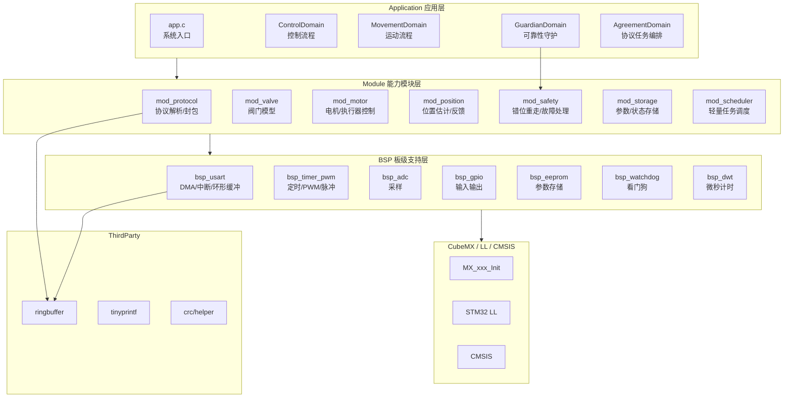
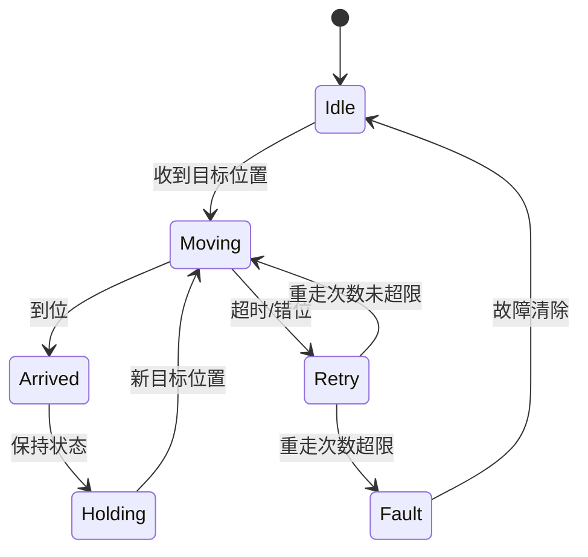
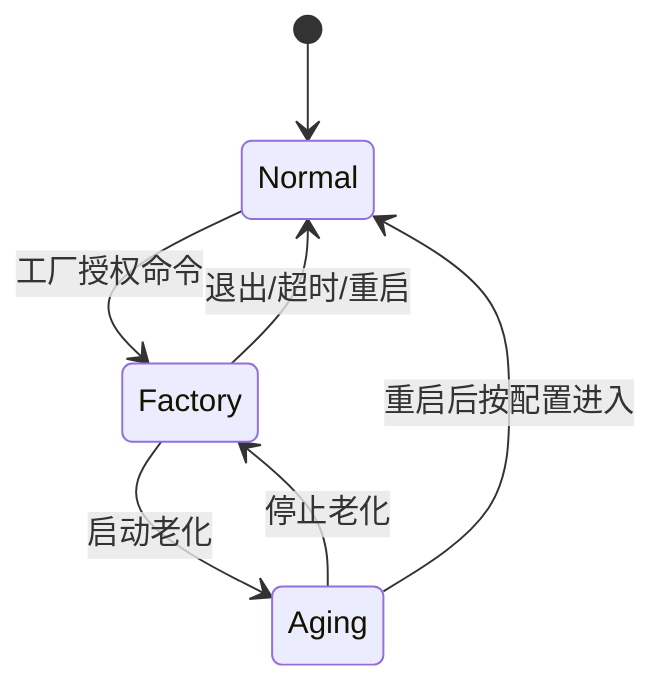

# 下世代通用阀门驱动平台软件架构工程文档

本文档面向 `nextG_universal_valve_drive_platform` 项目，描述一套适用于下世代通用阀门驱动平台的软件技术栈、分层架构、可靠性设计、测试策略、CI/CD 自动发布方案与持续演进路线。

项目目标中的“通用”包含四类可变因素：

1. 阀门类型通用：支持两位阀、多位阀。
2. 通信协议通用：支持多种上位机或总线协议。
3. 控制方式通用：支持开环控制、闭环控制。
4. 硬件平台通用：支持不同驱动电路、传感器输入和后续不同 MCU/板卡。

核心设计指标：

1. 通信实时性。
2. 阀门错位重走、系统保持高可靠性。
3. 代码易维护。
4. 单元测试覆盖。

初始条件：

1. 使用 STM32CubeMX 生成 LL 库代码和 CMake 工程。
2. 项目采用分层架构。
3. 当前主控为 STM32F103C8T6，Flash 和 RAM 容量较小，可能无法加载 Bootloader 和 A/B 双分区。
4. 电路板带有 4KB EEPROM，可用于保存设备参数、工厂配置和少量运行统计。
5. 必须支持 GitHub Actions，以实现自动化构建、测试、检查和版本发布。

## 1. 推荐技术栈

### 1.1 固件基础技术栈

| 方向 | 推荐技术 | 选择原因 |
| --- | --- | --- |
| 语言 | C11 | 与 CubeMX CMake 工程兼容，适合资源受限 MCU |
| MCU 驱动 | STM32 LL | 相比 HAL 更轻量、实时性更好、代码体积更可控 |
| 工程生成 | STM32CubeMX | 方便配置时钟、GPIO、DMA、USART、TIM、ADC 等外设 |
| 构建系统 | CMake + Ninja | 跨平台、适合 CI、便于分层 target 管理 |
| 编译器 | arm-none-eabi-gcc / STM32CubeCLT | GitHub Actions 和本地开发都容易获得 |
| 调试 | ST-Link + OpenOCD 或 STM32CubeProgrammer | 适合 STM32F103 开发和自动烧录 |
| 代码规范 | clang-format | 保持 C 代码风格一致 |
| 静态分析 | flawfinder、cppcheck、CodeQL | 覆盖安全风险、常见 C 问题和长期质量趋势 |
| 单元测试 | Ceedling + Unity + CMock | 适合嵌入式 C，命令简单，便于小白集成和 CI 自动化 |
| Mock / Fake | CMock 或手写 fake BSP | 用于隔离硬件依赖，测试 Module/Application |
| 覆盖率 | gcovr + gcov/lcov | 适合 PC 端 C 单元测试覆盖率统计 |
| 文档 | Markdown + Mermaid + Doxygen | Markdown 便于维护，Doxygen 可生成 API 文档 |
| 发布 | GitHub Actions + GitHub Release | 自动构建 `.elf/.hex/.bin/.map` 并发布版本 |

### 1.2 不推荐初期引入的技术

不建议初期引入 RTOS：

- STM32F103C8T6 Flash/RAM 较小。
- 当前指标更关注通信实时性和可靠控制，裸机事件循环足够起步。
- RTOS 会增加栈空间、调度复杂度和调试成本。

不建议初期引入复杂 Bootloader 和 A/B 分区：

- STM32F103C8T6 常见 Flash 资源紧张。
- A/B 双分区会明显挤压应用空间。
- 可先实现版本信息、固件 CRC、发布产物校验、出厂烧录流程；设备参数优先保存到板载 EEPROM。
- 后续如果换到更大 Flash MCU，再演进到 Bootloader、回滚和在线升级。

不建议在 Module/Application 中直接使用 HAL/LL：

- 会破坏可测试性。
- 会导致硬件差异扩散到业务层。
- 不利于后续支持不同硬件。

## 2. 总体架构

推荐架构：

```text
Application
  |
  v
Module
  |
  v
BSP
  |
  v
CubeMX / LL / CMSIS

ThirdParty 作为横向组件库，被各层按需依赖
Test/Fake 作为 PC 测试环境替代 BSP 或硬件输入
```

术语说明：

- Fake BSP：Fake Board Support Package，假的板级支持包。它在 PC 单元测试中模拟 `bsp_usart`、`bsp_pwm`、`bsp_adc` 等接口，不访问真实 STM32 硬件。
- Mock：测试替身，通常用于检查某个函数是否被调用、调用参数是否正确。CMock 是 Unity 测试生态中的 C 语言 mock 工具。
- HIL：Hardware In the Loop，硬件在环测试。测试脚本连接真实板卡，自动烧录、发串口命令并读取真实硬件结果。
- OSAL：Operating System Abstraction Layer，操作系统抽象层。本项目初期指裸机下的轻量调度和事件封装，不等同于完整 RTOS。
- Vendor：把第三方源码直接复制到本仓库的 `ThirdParty` 中，并固定当前版本。
- git submodule：Git 子模块，用一个独立 Git 仓库管理第三方组件，在主仓库中记录其提交号。

### 2.1 架构图



## 3. 关键设计思想

### 3.0 架构冻结原则

本项目当前处于规划阶段，但硬件资源有限、团队工程化经验仍在建立，因此需要尽早冻结主架构，后续只做小步演进，不做中途大换型。

冻结内容：

```text
Application -> Module -> BSP -> CubeMX/LL/CMSIS
ThirdParty 作为横向组件库
CMake 负责固件构建
Ceedling 负责 PC 单元测试
EEPROM 保存设备参数
TIM 定时器生成步进电机 STEP 脉冲
```

除非出现硬件设计变更或关键指标无法满足，不建议切换以下方向：

- 不在 STM32F103C8T6 上引入完整 RTOS 作为初期方案。
- 不把业务逻辑写回 `Core/Src/main.c`。
- 不让 Module 直接调用 LL/HAL。
- 不让 MCU 端解析 JSON/INI。
- 不用软件延时模拟步进电机脉冲。
- 不把参数优先写入片内 Flash。

后续允许的小步演进：

- RXNE 接收升级为 DMA + IDLE。
- 恒速步进升级为梯形加减速。
- Ceedling 覆盖率从只观察升级为设置门槛。
- Modbus 先 vendor 固定版本，稳定后再考虑 git submodule。

### 3.1 将“通用性”落到接口上

通用阀门平台不应把每一种阀门、每一种协议、每一种硬件都写成 if/else 堆在一起。

推荐把变化点抽象成接口：

1. 阀门类型变化：由 `mod_valve` 抽象两位阀、多位阀。
2. 协议变化：由 `mod_protocol` 管理协议适配器。
3. 控制方式变化：由 `mod_control` 或 `mod_valve_controller` 抽象开环/闭环策略。
4. 硬件变化：由 BSP 适配不同 USART、TIM、ADC、GPIO、驱动电路。

### 3.2 将“实时性”放在 BSP 和调度策略中保证

通信实时性主要依赖：

- USART 中断或 DMA 接收。
- 环形缓冲区。
- 主循环中短任务、快进快出。
- 协议解析增量执行，不在中断中做复杂解析。
- 发送队列和非阻塞发送。
- 固定周期任务由 TIM tick 或轻量 scheduler 调度。

中断中只做必要工作：

```text
接收字节/DMA 半满/全满 -> 写入 ringbuffer -> 设置事件标志
```

主循环或调度器中完成：

```text
读取 ringbuffer -> 协议解析 -> 生成命令事件 -> 执行控制状态机
```

### 3.3 将“可靠性”放在状态机和守护模块中保证

阀门错位重走和系统保持高可靠性，不应散落在电机控制代码里。

推荐建立独立的可靠性链路：

```text
mod_position 负责判断当前位置
mod_valve 负责目标位置和阀门模型
mod_safety 负责错位检测、重走策略、故障锁定
app_guardian 负责系统级守护和降级策略
```

典型错位重走流程：

```text
收到目标位置命令
  -> 检查当前状态是否允许动作
  -> 启动执行器
  -> 等待位置反馈或运行时间到达
  -> 判断是否到位
      -> 到位：记录状态，回复成功
      -> 未到位：执行重走
      -> 重走超过限制：进入故障保持
```

### 3.4 将“可测试性”作为架构约束

能够在 PC 上测试的代码，不允许直接依赖 STM32 LL。

应优先把以下逻辑写成纯 C：

- 协议解析。
- 状态机。
- 阀门位置模型。
- 错位重走策略。
- 参数校验。
- 环形缓冲。
- 控制策略的决策部分。

硬件操作通过接口或 BSP fake 替代。

## 4. 推荐模块划分

### 4.1 Application 层

推荐文件：

```text
Application/
  Inc/
    app.h
    app_control.h
    app_movement.h
    app_guardian.h
    app_agreement.h
  Src/
    app.c
    app_control.c
    app_movement.c
    app_guardian.c
    app_agreement.c
```

职责：

- `app_Init()`：应用层初始化。
- `app_MainLoop()`：主循环调度入口。
- `app_control`：阀门控制业务流程。
- `app_movement`：动作流程编排。
- `app_guardian`：系统级可靠性守护。
- `app_agreement`：协议任务和命令分发。

### 4.2 Module 层

推荐文件：

```text
Module/
  Inc/
    mod_protocol.h
    mod_valve.h
    mod_motor.h
    mod_position.h
    mod_safety.h
    mod_storage.h
    mod_scheduler.h
  Src/
    mod_protocol.c
    mod_valve.c
    mod_motor.c
    mod_position.c
    mod_safety.c
    mod_storage.c
    mod_scheduler.c
```

职责：

- `mod_protocol`：多协议解析、命令封包、校验。
- `mod_valve`：两位阀、多位阀统一模型。
- `mod_motor`：执行器控制抽象。
- `mod_position`：位置反馈、位置估计、闭环输入。
- `mod_safety`：错位重走、超时、故障保持。
- `mod_storage`：参数、校准值、运行统计。
- `mod_scheduler`：轻量任务调度。

### 4.3 BSP 层

推荐文件：

```text
BSP/
  Inc/
    bsp.h
    bsp_usart.h
    bsp_timer.h
    bsp_pwm.h
    bsp_adc.h
    bsp_eeprom.h
    bsp_gpio.h
    bsp_watchdog.h
    bsp_dwt.h
  Src/
    bsp.c
    bsp_usart.c
    bsp_timer.c
    bsp_pwm.c
    bsp_adc.c
    bsp_eeprom.c
    bsp_gpio.c
    bsp_watchdog.c
    bsp_dwt.c
```

职责：

- 使用 CubeMX 初始化结果。
- 使用 STM32 LL 操作外设。
- 封装 DMA、中断、GPIO、TIM、ADC、IWDG。
- 封装 EEPROM 读写、页边界处理和写入校验。
- 为 Module 提供硬件无关的接口。

## 5. 控制模型设计

### 5.1 阀门模型

推荐使用统一模型描述两位阀和多位阀：

```c
typedef enum {
    MOD_VALVE_TYPE_TWO_POSITION,
    MOD_VALVE_TYPE_MULTI_POSITION,
} mod_valve_type_t;

typedef enum {
    MOD_VALVE_STATE_UNKNOWN,
    MOD_VALVE_STATE_IDLE,
    MOD_VALVE_STATE_MOVING,
    MOD_VALVE_STATE_HOLDING,
    MOD_VALVE_STATE_FAULT,
} mod_valve_state_t;
```

两位阀可以视为多位阀的特例：

```text
两位阀：position = 0 / 1
多位阀：position = 0 / 1 / 2 / ... / N
```

这样上层控制流程可以统一处理：

```text
mod_valve_SetTargetPosition(position)
mod_valve_GetCurrentPosition()
mod_valve_IsTargetReached()
```

### 5.2 开环控制

开环控制依赖：

- 目标位置。
- 固定运行时间。
- 固定脉冲数量。
- 当前估计位置。

优点：

- 硬件成本低。
- 资源占用小。

风险：

- 无法直接确认是否真实到位。
- 需要更强的超时、重走和故障策略。

### 5.3 闭环控制

闭环控制依赖：

- 光电输入。
- 霍尔输入。
- ADC 位置反馈。
- 编码器或其他位置反馈。

优点：

- 可确认位置。
- 支持错位检测。

风险：

- 需要处理传感器抖动、异常值、超时。
- 需要滤波和状态判定。

### 5.4 错位重走策略

推荐参数：

```text
最大重走次数
单次动作超时时间
反向释放时间
到位稳定判定时间
传感器异常判定时间
故障保持策略
```

推荐状态机：



故障保持原则：

- 不要无限重试。
- 不要在未知位置继续执行危险动作。
- 进入故障后保留错误码和最后状态。
- 通信协议应能读取故障原因。

### 5.5 42 步进电机驱动方案

本项目的电机驱动目标是控制 42 步进电机走指定距离，并支持光感触发急停。推荐使用硬件定时器生成 STEP 脉冲，不推荐使用软件延时或主循环翻转 GPIO 模拟脉冲。

推荐结论：

```text
TIM 硬件定时器生成 STEP 脉冲
GPIO 控制 DIR / EN
EXTI 或快速轮询读取光感急停
Module 层负责距离、速度、状态机和安全策略
BSP 层负责定时器、GPIO、急停输入的硬件操作
```

#### 5.5.1 为什么不用软件模拟脉冲

软件模拟脉冲通常指在主循环或延时函数中反复拉高/拉低 STEP 引脚。这种方式不适合本项目。

原因：

1. 通信、协议解析、看门狗、老化统计等任务会打断软件延时，导致脉冲抖动。
2. 速度越高，软件模拟越难保证占空比和频率稳定。
3. 光感急停需要快速响应，软件延时中可能错过最佳停止时机。
4. 后续如果要做加减速曲线，软件模拟会让控制逻辑和时序逻辑严重耦合。

硬件定时器更适合：

1. TIM 输出比较或 PWM 可以稳定输出 STEP 脉冲。
2. 改变 ARR/CCR 即可改变速度。
3. 通过定时器更新中断统计步数，到达目标步数后停止。
4. 光感急停可在 EXTI 中立即关闭定时器输出。

#### 5.5.2 推荐分层

```text
BSP:
  bsp_stepper_pulse
  bsp_gpio / bsp_exti

Module:
  mod_motor
  mod_position
  mod_safety

Application:
  app_movement
  app_guardian
```

BSP 职责：

- 配置 TIM 输出 STEP 脉冲。
- 配置 DIR、EN 引脚。
- 配置光感输入 GPIO/EXTI。
- 提供立即停止接口。
- 不理解“距离”“阀门位置”“错位重走”等业务概念。

Module 职责：

- 距离换算为步数。
- 速度换算为脉冲频率。
- 管理运动状态机。
- 处理目标步数完成、光感急停、超时、错位重走。
- 输出故障码和运动结果。

Application 职责：

- 决定何时启动运动。
- 根据协议命令、工厂模式、老化模式调用 Module。
- 读取运行结果并上报。

#### 5.5.3 BSP 接口建议

```c
typedef enum {
    BSP_STEPPER_DIR_FORWARD = 0,
    BSP_STEPPER_DIR_REVERSE,
} bsp_stepper_dir_t;

int bsp_stepper_Init(void);
int bsp_stepper_SetDirection(bsp_stepper_dir_t dir);
int bsp_stepper_SetFrequency(uint32_t frequency_hz);
int bsp_stepper_Start(void);
int bsp_stepper_Stop(void);
int bsp_stepper_StopImmediate(void);
uint8_t bsp_stepper_IsEmergencyActive(void);
```

说明：

- `bsp_stepper_Stop()` 用于正常减速或到达目标后停止。
- `bsp_stepper_StopImmediate()` 用于光感急停、故障、看门狗前保护等紧急路径。
- `bsp_stepper_IsEmergencyActive()` 只返回硬件输入状态，不做业务判断。

#### 5.5.4 Module 接口建议

```c
typedef enum {
    MOD_MOTOR_STATE_IDLE = 0,
    MOD_MOTOR_STATE_RUNNING,
    MOD_MOTOR_STATE_ARRIVED,
    MOD_MOTOR_STATE_EMERGENCY_STOP,
    MOD_MOTOR_STATE_FAULT,
} mod_motor_state_t;

typedef struct {
    int32_t target_steps;
    uint32_t speed_hz;
    uint32_t timeout_ms;
} mod_motor_move_t;

int mod_motor_Init(void);
int mod_motor_MoveSteps(const mod_motor_move_t *move);
int mod_motor_Stop(void);
int mod_motor_Poll(void);
mod_motor_state_t mod_motor_GetState(void);
```

初期建议只实现恒速运动：

```text
距离 -> 步数
速度 -> 定时器频率
目标步数到达 -> 停止
光感触发 -> 立即停止
超时 -> 故障
```

后续再扩展：

- 梯形加减速。
- S 曲线加减速。
- 多通道运动队列。
- 闭环到位确认。

#### 5.5.5 光感急停策略

光感急停属于安全路径，推荐优先级高于正常运动完成。

推荐实现：

1. 光感输入接入 EXTI，触发边沿由实际电路决定。
2. EXTI 中只做极少操作：关闭 STEP 定时器输出、设置 emergency flag。
3. `mod_motor_Poll()` 读取 emergency flag，进入 `MOD_MOTOR_STATE_EMERGENCY_STOP`。
4. `mod_safety` 决定是否重走、故障保持或等待人工/上位机清除。

不建议在 EXTI 中做协议回复、日志格式化、EEPROM 写入等耗时操作。

#### 5.5.6 现成库和移植建议

可参考但不建议直接重度移植：

| 方案 | 适合用途 | 建议 |
| --- | --- | --- |
| AccelStepper | 参考步进电机 API、恒速/加减速概念 | Arduino/C++ 风格，直接移植成本较高，建议只参考设计 |
| GRBL stepper planner | 参考运动规划、加减速队列 | 功能偏重，适合 CNC，不适合当前小资源项目直接集成 |
| ST X-CUBE-SPN 系列 | 参考 STM32 电机驱动分层、TIM/GPIO/IRQ 组织 | 多数面向 STSPIN/BLDC/特定扩展板，建议参考结构，不直接作为核心库 |

本项目推荐自研轻量驱动：

```text
bsp_stepper_pulse：硬件定时器脉冲
mod_motor：距离、速度、状态机
mod_safety：急停、超时、错位重走
```

这样代码体积可控，也更符合 STM32F103C8T6 的资源限制。

## 6. 通信实时性设计

### 6.1 USART 接收推荐方案

优先级推荐：

1. DMA + IDLE 中断。
2. DMA 半满/全满中断。
3. RXNE 中断逐字节接收。

STM32F103C8T6 可先使用 RXNE 中断或 DMA 环形接收，后续根据协议速率升级。

推荐链路：

```text
USART ISR/DMA
  -> bsp_usart 写 ringbuffer
  -> 设置 rx_event
  -> app_MainLoop/mod_scheduler 调用 mod_protocol_Poll
```

### 6.2 协议解析原则

- 协议解析必须支持增量输入。
- 不要求一次收到完整帧。
- 每次解析限制最大处理字节数，避免阻塞主循环。
- 非法帧要快速丢弃并恢复同步。
- 协议层不直接控制硬件，只输出命令事件。

### 6.3 发送策略

推荐：

- 短回复可以直接发送。
- 高频回复使用发送队列。
- 中断或 DMA 完成后继续发送下一段。
- 不在业务层等待串口发送完成。

## 7. 资源约束设计

STM32F103C8T6 资源有限，设计上应遵守：

1. 禁止在固件中使用动态内存分配，避免 `malloc/free`。
2. 避免大型全局缓冲区。
3. ringbuffer 大小按协议最大帧和峰值吞吐计算。
4. 日志输出可编译开关控制。
5. 不在 Release 中保留大量调试字符串。
6. 协议解析使用状态机，不复制大块数据。
7. 闭环滤波算法优先选择轻量整数算法。
8. CMake 提供 Debug/Release 配置差异。

推荐编译宏：

```text
APP_ENABLE_LOG
APP_ENABLE_ASSERT
APP_ENABLE_DIAGNOSTIC
APP_PROTOCOL_MAX_FRAME_SIZE
APP_USART_RX_BUFFER_SIZE
```

## 8. 代码解耦规则

### 8.1 依赖方向

必须遵守：

```text
Application -> Module -> BSP -> CubeMX/LL
```

禁止：

```text
Module -> Application
BSP -> Module
BSP -> Application
Application -> BSP
Module -> LL/HAL
```

### 8.2 命名规则

命名规则只约束项目自有的 `Application`、`Module`、`BSP` 三部分，不修改 CubeMX 生成的 `Core`、`Drivers`、`cmake/stm32cubemx` 代码，也不修改 `ThirdParty` 内第三方源码的原始命名。

目录名保持架构语义：

```text
Application/
Module/
BSP/
ThirdParty/
```

代码前缀统一为短前缀：

| 层级 | 文件前缀 | 函数前缀 | 类型前缀 | 宏/枚举前缀 |
| --- | --- | --- | --- | --- |
| Application | `app_` | `app_` | `app_` | `APP_` |
| Module | `mod_` | `mod_` | `mod_` | `MOD_` |
| BSP | `bsp_` | `bsp_` | `bsp_` | `BSP_` |

函数命名使用 `prefix_component_ActionObject()`：

```c
void app_Init(void);
void app_MainLoop(void);
void app_control_Poll(void);

int mod_protocol_Poll(void);
int mod_valve_SetTargetPosition(uint8_t position);
int mod_valve_GetCurrentPosition(uint8_t *position);
int mod_safety_Poll(void);

int bsp_usart_Send(const uint8_t *data, uint16_t len);
int bsp_usart_RegisterRxCallback(bsp_usart_rx_callback_t callback);
```

文件命名使用小写下划线，文件名前缀必须和所属层一致：

```text
Application/Inc/app_control.h
Application/Src/app_control.c
Module/Inc/mod_valve.h
Module/Src/mod_valve.c
BSP/Inc/bsp_usart.h
BSP/Src/bsp_usart.c
ThirdParty/ringbuffer/ringbuffer.h
ThirdParty/ringbuffer/ringbuffer.c
```

文件夹命名规则：

```text
Application、Module、BSP、ThirdParty 使用首字母大写，表示架构层。
Inc、Src 使用首字母大写，和 CubeMX 目录风格保持一致。
第三方组件子目录使用小写，例如 ringbuffer、event、modbus、osal、log。
```

变量命名使用小写下划线：

```c
uint8_t target_position;
uint16_t retry_count;
bool is_position_reached;
```

结构体、枚举、函数指针类型使用小写下划线并以 `_t` 结尾：

```c
typedef struct {
    uint8_t target_position;
    uint8_t current_position;
} mod_valve_context_t;

typedef enum {
    MOD_VALVE_STATE_IDLE,
    MOD_VALVE_STATE_MOVING,
    MOD_VALVE_STATE_FAULT,
} mod_valve_state_t;

typedef void (*bsp_usart_rx_callback_t)(const uint8_t *data, uint16_t len);
```

宏和枚举值使用全大写下划线：

```c
#define MOD_PROTOCOL_MAX_FRAME_SIZE 64U
#define BSP_USART_RX_BUFFER_SIZE 128U
```

静态函数使用小写下划线，不需要层级前缀：

```c
static int parse_frame_header(const uint8_t *data, uint16_t len);
```

ThirdParty 规则：

- `ThirdParty` 内文件、函数、类型、宏保持上游原名称，不受本项目命名规则约束。
- 这样可以直接引用第三方文件，减少移植成本，降低后续升级时的冲突。
- 如果确实需要写项目自有适配层，适配层不要放进第三方源码目录，建议放到 `Module` 或 `BSP` 中，并使用 `mod_` 或 `bsp_` 前缀。
- CMake target 使用组件名，例如 `ringbuffer`、`event`、`modbus`、`osal`、`log`。

### 8.3 接口隔离

Module 头文件中不出现 STM32 硬件类型：

```c
GPIO_TypeDef *
USART_TypeDef *
TIM_TypeDef *
```

BSP 内部可以使用这些类型，但不能把它们泄漏给 Module 和 Application。

### 8.4 事件解耦

推荐建立轻量事件模型：

```text
协议收到命令 -> command_event
阀门到位 -> valve_event
故障发生 -> fault_event
周期 tick -> tick_event
```

初期可使用简单标志位和固定队列，避免引入复杂事件总线。

## 9. CMake 组织方案

推荐每层一个 `CMakeLists.txt`：

```text
BSP/CMakeLists.txt
Module/CMakeLists.txt
Application/CMakeLists.txt
ThirdParty/CMakeLists.txt
test/
project.yml
```

顶层：

```cmake
add_subdirectory(BSP)
add_subdirectory(Module)
add_subdirectory(Application)

target_link_libraries(${CMAKE_PROJECT_NAME}
    application
)
```

依赖链：

```cmake
# Application/CMakeLists.txt
target_link_libraries(application PUBLIC module)

# Module/CMakeLists.txt
target_link_libraries(module PUBLIC bsp ringbuffer)

# BSP/CMakeLists.txt
target_link_libraries(bsp PUBLIC stm32cubemx)
```

这样 CMake 结构和软件架构一致。

## 10. 可执行落地步骤

### 阶段 1：固化基础工程

目标：

- 当前 CubeMX + CMake 工程稳定编译。
- 不改变外设初始化方式。

步骤：

1. 本地执行 Debug 构建。
2. 本地执行 Release 构建。
3. 确认 GitHub Actions build 成功。
4. 确认 `.elf/.hex/.bin` 能生成。
5. 保留 `Core`、`Drivers`、`cmake/stm32cubemx` 的 CubeMX 生成属性。

验收：

- 编译通过。
- 固件产物可下载。

### 阶段 2：建立分层 target

目标：

- 建立 `application`、`module`、`bsp` 三个 CMake target。

步骤：

1. 补齐 `BSP/CMakeLists.txt`。
2. 新增 `Module/CMakeLists.txt`。
3. 新增 `Application/CMakeLists.txt`。
4. 顶层 `CMakeLists.txt` 加入三个 `add_subdirectory()`。
5. 按 `application -> module -> bsp -> stm32cubemx` 链接。
6. 编译验证。

验收：

- Debug/Release 编译通过。
- 上层不直接链接下下层。

### 阶段 3：建立应用入口

目标：

- `Core/Src/main.c` 只负责启动和调用应用入口。

步骤：

1. 新增 `Application/Inc/app.h`。
2. 新增 `Application/Src/app.c`。
3. 实现：

```c
void app_Init(void);
void app_MainLoop(void);
```

4. `main.c` 在 USER CODE Includes 中包含 `app.h`。
5. CubeMX 外设初始化后调用 `app_Init()`。
6. `while(1)` 中调用 `app_MainLoop()`。

验收：

- `main.c` 中没有业务状态机。
- 后续业务入口统一从 `app.c` 开始阅读。

### 阶段 4：通信链路落地

目标：

- 实现通信实时性基础链路。

步骤：

1. 新增 `bsp_usart`。
2. 新增 ringbuffer 组件。
3. USART 接收中断或 DMA 写入 ringbuffer。
4. 新增 `mod_protocol`。
5. `mod_protocol_Poll()` 从 ringbuffer 增量解析。
6. 协议解析输出命令事件。
7. Application 消费命令事件。

验收：

- 中断中不做完整协议解析。
- 协议解析可单元测试。
- 通信压力下主循环不长时间阻塞。

### 阶段 5：阀门控制模型落地

目标：

- 两位阀和多位阀使用统一控制模型。

步骤：

1. 新增 `mod_valve`。
2. 定义阀门类型、目标位置、当前位置、状态。
3. 新增 `mod_motor` 或执行器控制模块。
4. 新增 `mod_position`。
5. 支持开环位置估计。
6. 预留闭环反馈接口。

验收：

- 两位阀不需要单独写一套业务流程。
- 多位阀扩展时不破坏 Application。

### 阶段 6：错位重走和可靠性落地

目标：

- 支持阀门错位重走和故障保持。

步骤：

1. 新增 `mod_safety`。
2. 定义故障码。
3. 定义动作超时。
4. 定义最大重走次数。
5. 定义到位判断接口。
6. 定义故障保持状态。
7. `app_guardian` 周期调用安全检查。

验收：

- 未到位时可重走。
- 重走超过次数进入故障。
- 故障可通过协议读取。
- 故障清除有明确入口。

### 阶段 7：单元测试落地

目标：

- 核心纯软件模块具备 PC 单元测试。

步骤：

1. 新增 `test` 目录和 `project.yml`。
2. 引入 Ceedling，由 Ceedling 统一管理 Unity、CMock 和 gcov。
3. 先测试 ringbuffer。
4. 再测试 `mod_protocol`。
5. 再测试 `mod_motor` 的距离换算、速度参数和急停状态机。
6. 再测试 `mod_valve` 和 `mod_safety` 状态机。
7. 使用 CMock 或 fake BSP 测试 Module 与硬件交互边界。

验收：

- 本地可运行 `ceedling test:all`。
- CI 可运行 `ceedling test:all`。
- 每个协议解析分支都有测试。
- 错位重走状态机有测试。

### 阶段 8：覆盖率落地

目标：

- 自动生成测试覆盖率报告。

步骤：

1. PC 测试构建开启 coverage flags。
2. 使用 gcovr 生成 HTML/XML 报告。
3. GitHub Actions 上传覆盖率 artifact。
4. 初期只观察覆盖率。
5. 稳定后为核心模块设置门槛。

建议门槛：

```text
阶段 A：不设门槛，只生成报告
阶段 B：mod_protocol 行覆盖率 >= 60%
阶段 C：mod_safety 行覆盖率 >= 70%
阶段 D：核心纯软件模块整体行覆盖率 >= 70%
```

不建议对 BSP 设置强覆盖率门槛。

### 阶段 9：自动化发布落地

目标：

- tag 触发自动发布版本。

步骤：

1. GitHub Actions 增加 release workflow。
2. 触发条件为 tag，例如 `v0.1.0`。
3. 自动执行 Release 构建。
4. 自动运行静态分析和单元测试。
5. 测试通过后上传：

```text
firmware.elf
firmware.hex
firmware.bin
firmware.map
coverage report
build log
```

6. 自动创建 GitHub Release。
7. Release notes 中写入 commit hash、构建时间、构建配置。

验收：

- 推送 tag 后自动生成 Release。
- Release 中包含可烧录固件。
- 测试失败时不发布。

## 11. CI/CD 设计

### 11.1 CI job 划分

推荐 GitHub Actions workflow：

```text
build.yml          固件编译
static.yml         静态分析
format.yml         格式检查
test.yml           PC 单元测试
coverage.yml       覆盖率报告
release.yml        tag 自动发布
```

初期也可以合并为较少文件：

```text
ci.yml             编译 + 静态检查 + 单元测试
release.yml        发布
```

### 11.2 PR 必须检查项

建议 PR 阶段必须通过：

1. 固件 Debug 构建。
2. 固件 Release 构建。
3. clang-format 检查。
4. cppcheck 或 flawfinder。
5. PC 单元测试。
6. 覆盖率报告生成。

### 11.3 main 分支检查项

merge 到 main 后：

1. Release 构建。
2. 上传短期 artifact。
3. 输出固件大小。
4. 输出 map 文件。

### 11.4 tag 发布检查项

tag 触发：

1. 清洁构建。
2. 静态分析。
3. 单元测试。
4. 覆盖率报告。
5. 固件产物生成。
6. GitHub Release 发布。

发布失败原则：

- 编译失败：不发布。
- 单元测试失败：不发布。
- 核心覆盖率低于门槛：不发布。
- 静态分析出现高危问题：不发布。

## 12. 自动测试方案

### 12.0 推荐测试框架

推荐使用 Ceedling 统一管理 PC 单元测试。

选择 Ceedling 的原因：

1. Ceedling 集成 Unity、CMock、gcov，适合嵌入式 C 项目。
2. 测试命令简单，适合初学者：`ceedling test:all`。
3. 测试文件、mock、覆盖率可以逐步引入，不要求一开始搭很复杂。
4. CMake 继续负责固件交叉编译，Ceedling 只负责 PC 单元测试，职责清晰。
5. 后续 GitHub Actions 中可以直接执行 Ceedling 命令。

推荐策略：

```text
CMake: 构建 STM32 固件
Ceedling: 构建和运行 PC 单元测试
GitHub Actions: 同时运行 CMake build 和 Ceedling test
```

不建议初期把所有测试都塞进 CMake/CTest。CTest 很通用，但小白需要自己处理 Unity、mock、覆盖率和测试 runner；Ceedling 已经把这些常见嵌入式 C 测试工作封装好了。

### 12.1 PC 单元测试

测试对象：

- ringbuffer。
- 协议解析。
- 状态机。
- 错位重走。
- 参数校验。
- 开环位置估计。
- 闭环位置判定算法。

不直接测试：

- LL 寄存器操作。
- CubeMX 初始化函数。

### 12.2 Fake BSP 测试

为 Module 提供 fake 实现：

```text
test/support/fake_bsp_usart.c
test/support/fake_bsp_pwm.c
test/support/fake_bsp_adc.c
test/support/fake_bsp_gpio.c
```

用途：

- 验证协议命令是否触发正确控制行为。
- 验证电机动作是否产生正确 PWM/方向输出请求。
- 验证传感器异常是否触发故障。

Ceedling 中可优先使用 CMock 自动生成 BSP mock：

```c
#include "unity.h"
#include "mod_motor.h"
#include "mock_bsp_stepper.h"

void test_mod_motor_should_stop_immediately_when_emergency_active(void)
{
    bsp_stepper_IsEmergencyActive_ExpectAndReturn(1);
    bsp_stepper_StopImmediate_ExpectAndReturn(0);

    mod_motor_Poll();

    TEST_ASSERT_EQUAL(MOD_MOTOR_STATE_EMERGENCY_STOP, mod_motor_GetState());
}
```

如果某些硬件行为需要更真实的模拟，可以手写 fake：

```text
test/support/fake_bsp_stepper.c
test/support/fake_bsp_stepper.h
```

使用原则：

- CMock：适合验证“有没有调用某个 BSP 函数、参数是否正确”。
- fake：适合模拟一段连续状态，例如步数递减、光感触发、EEPROM 回读。

### 12.3 集成测试

PC 集成测试链路：

```text
test input bytes
  -> mod_protocol
  -> command event
  -> mod_valve/mod_safety
  -> fake_bsp output
```

验证：

- 协议输入到控制输出是否正确。
- 错位时是否重走。
- 超限时是否故障保持。

### 12.4 硬件在环测试

后期可增加：

- 使用 self-hosted runner。
- 自动烧录固件。
- 串口发送测试命令。
- 读取返回帧。
- 检查 GPIO/PWM/ADC 行为。

硬件在环测试适合作为：

- 夜间测试。
- 发布前测试。
- 硬件版本变更后的验证测试。

### 12.5 Ceedling 小白集成步骤

推荐目录：

```text
test/
  test_mod_protocol.c
  test_mod_motor.c
  test_mod_safety.c
  support/
    fake_bsp_stepper.c
    fake_bsp_stepper.h
project.yml
```

第一阶段只测试不依赖硬件的纯 C 逻辑：

```text
mod_protocol
mod_valve
mod_safety
mod_motor 的距离/速度换算
```

第二阶段再引入 BSP mock：

```text
mock_bsp_stepper
mock_bsp_usart
mock_bsp_eeprom
```

第三阶段再生成覆盖率：

```bash
ceedling gcov:all
```

本地常用命令：

```bash
ceedling test:all
ceedling test:test_mod_motor
ceedling gcov:all
ceedling clobber
```

建议从最小 `project.yml` 开始：

```yaml
:project:
  :use_exceptions: FALSE
  :use_test_preprocessor: TRUE
  :use_auxiliary_dependencies: TRUE

:paths:
  :test:
    - +:test/**
  :source:
    - Module/Src/**
    - ThirdParty/ringbuffer/**
  :include:
    - Module/Inc
    - BSP/Inc
    - ThirdParty/ringbuffer
    - test/support

:plugins:
  :enabled:
    - gcov
    - junit_tests_report

:gcov:
  :reports:
    - HtmlDetailed
    - Cobertura
```

注意：

- 初期不要把 `Core`、`Drivers`、`BSP/Src` 全部加入 Ceedling source。
- 先让 Module 的纯 C 逻辑跑通测试。
- 对 BSP 依赖使用 CMock 或 fake 替代。
- 测试通过后再慢慢扩大覆盖范围。

### 12.6 GitHub Actions 测试建议

建议 CI 分两条线：

```text
build job: 使用 CMake 编译 STM32 固件
test job: 使用 Ceedling 运行 PC 单元测试和覆盖率
```

最小 test job：

```yaml
name: Unit Test

on:
  push:
    branches: [ main ]
  pull_request:
    branches: [ main ]

jobs:
  ceedling:
    runs-on: ubuntu-22.04
    steps:
      - uses: actions/checkout@v4

      - name: Install Ruby and Ceedling
        run: |
          sudo apt-get update
          sudo apt-get install -y ruby gcovr
          gem install ceedling

      - name: Run unit tests
        run: ceedling test:all

      - name: Run coverage
        run: ceedling gcov:all
```

后续可增加：

- 上传 JUnit 测试报告。
- 上传 HTML 覆盖率报告。
- 设置核心模块覆盖率门槛。
- tag 发布前强制测试通过。

## 13. 自动发布版本方案

### 13.1 版本命名

推荐语义版本：

```text
vMAJOR.MINOR.PATCH
```

示例：

```text
v0.1.0
v0.2.0
v1.0.0
```

### 13.2 固件内版本信息

建议固件中包含：

```text
版本号
Git commit hash
构建时间
硬件版本
协议版本
```

可通过协议命令读取。

### 13.3 发布产物

Release 必须包含：

```text
nextG_universal_valve_drive_platform.elf
nextG_universal_valve_drive_platform.hex
nextG_universal_valve_drive_platform.bin
nextG_universal_valve_drive_platform.map
firmware-info.txt
coverage-summary.txt
```

`firmware-info.txt` 建议包含：

```text
project
version
commit
build_type
compiler
build_time
flash_size
ram_size
```

### 13.4 无 A/B 分区条件下的发布安全策略

由于 STM32F103C8T6 资源有限，初期不强制实现 Bootloader 和 A/B 双分区。

替代策略：

1. GitHub Release 固件产物带 SHA256。
2. Release 构建必须可复现。
3. 固件内置版本信息。
4. 烧录工具校验写入结果。
5. 保留上一个稳定 Release。
6. 现场升级前明确记录旧版本。
7. 后续切换大容量 MCU 时再实现 Bootloader 回滚。

## 14. 自动化工具支援

### 14.1 本地开发工具

推荐：

```text
VSCode
CMake Tools
clangd
ARM GNU Toolchain
STM32CubeMX
STM32CubeProgrammer
Ninja
Git
```

### 14.2 质量工具

推荐：

```text
clang-format
cppcheck
flawfinder
CodeQL
gcovr
Ceedling
Unity
CMock
Doxygen
```

### 14.3 推荐命令

构建：

```bash
cmake --preset Debug
cmake --build --preset Debug
cmake --preset Release
cmake --build --preset Release
```

测试：

```bash
ceedling test:all
```

覆盖率：

```bash
ceedling gcov:all
```

格式检查：

```bash
clang-format --dry-run --Werror Application/**/*.c Application/**/*.h Module/**/*.c Module/**/*.h BSP/**/*.c BSP/**/*.h
```

## 15. ThirdParty 组件管理建议

### 15.1 ThirdParty 管理原则

`ThirdParty` 目录用于保存必须引入的外部组件。该目录内的第三方源码保持原始文件名、函数名、类型名和宏定义，不套用项目的 `app_`、`mod_`、`bsp_` 命名规则。

这样做的原因：

1. 可以直接引用上游文件，减少移植改动。
2. 后续升级第三方库时更容易比较差异。
3. 避免为了命名统一而维护大量无意义 patch。
4. 第三方库问题和项目自有代码问题边界更清楚。

推荐目录：

```text
ThirdParty/
  ringbuffer/
  event/
  modbus/
  osal/
  log/
  CMakeLists.txt
```

### 15.2 是否使用 git 子仓库

不建议一开始全部使用 git submodule。

推荐优先级：

1. 小型、稳定、文件数量少的库：直接 vendor 到 `ThirdParty`。
2. 需要频繁跟随上游升级的库：使用 git submodule。
3. 公司内部复用库：使用 git subtree 或独立仓库加版本 tag。

对当前项目，更推荐：

| 组件 | 推荐管理方式 | 原因 |
| --- | --- | --- |
| ringbuffer | 直接 vendor | 代码小，稳定，后续很少变 |
| event/message | 直接 vendor 或自研 | 和项目调度模型耦合较强 |
| Modbus | submodule 或 vendor 固定版本 | 协议库较完整，可能需要跟随上游修 bug |
| OSAL | 自研或 vendor | STM32F103 资源小，简单调度更可控 |
| log | 自研轻量封装 + tinyprintf vendor | 需要按 Flash/RAM 裁剪 |

git submodule 的优点：

- 能清楚锁定第三方库版本。
- 能方便拉取上游更新。
- 适合较大、独立维护的组件。

git submodule 的缺点：

- 初学者容易忘记 `--recursive`。
- CI 需要额外配置 submodules。
- 离线构建和归档发布稍麻烦。
- 第三方库如果需要本地 patch，维护成本会上升。

因此建议短期采用：

```text
直接 vendor ringbuffer、event、osal、log
Modbus 可先 vendor 固定版本；稳定后再考虑 submodule
```

等团队熟悉 GitHub Actions、版本发布和依赖升级流程后，再把体量较大的 Modbus 库迁移为 submodule。

### 15.3 必须组件建议

#### 环形队列

用途：

- USART 接收缓冲。
- 协议解析输入缓冲。
- 日志输出缓冲。

要求：

- 不使用动态内存。
- 支持字节流读写。
- 支持查询剩余空间和已用空间。
- 支持中断写、主循环读的单生产者单消费者场景。

#### 消息/事件通知

用途：

- 协议命令通知控制流程。
- 到位、错位、超时、故障事件通知。
- 周期任务触发。

建议实现：

- 初期使用固定长度事件队列。
- 事件结构体只保存事件类型和少量参数。
- 不在事件中保存大块数据。

示例：

```c
typedef enum {
    MOD_EVENT_NONE = 0,
    MOD_EVENT_PROTOCOL_COMMAND,
    MOD_EVENT_VALVE_ARRIVED,
    MOD_EVENT_VALVE_MISALIGNED,
    MOD_EVENT_FAULT,
    MOD_EVENT_TICK_1MS,
} mod_event_type_t;

typedef struct {
    mod_event_type_t type;
    uint16_t param;
} mod_event_t;
```

#### Modbus

用途：

- 作为量产、调试和上位机配置的首选协议之一。
- 适合配置寄存器、状态读取、故障读取。

建议：

- 优先支持 Modbus RTU slave。
- 地址、波特率、校验方式作为设备参数保存。
- 配置参数映射为 holding registers。
- 状态、故障、老化统计映射为 input registers。
- 写参数后需要显式执行保存命令，避免误写 EEPROM。

#### OSAL 简单线程调度

当前不建议引入完整 RTOS。建议实现轻量 OSAL：

```text
osal_Init()
osal_GetTick()
osal_DelayMs()
osal_TaskRegister()
osal_TaskPoll()
osal_EventPost()
osal_EventFetch()
```

特点：

- 裸机 cooperative scheduler。
- 固定任务表。
- 无动态内存。
- 支持周期任务和事件任务。
- 方便后续替换为 RTOS API。

#### log 记录

用途：

- 工厂调试。
- 老化模式统计。
- 故障定位。

建议：

- 日志分级：ERROR、WARN、INFO、DEBUG。
- Release 默认只保留 ERROR/WARN。
- 日志输出可以走 USART 或内存环形缓冲。
- 使用编译宏裁剪。

示例宏：

```text
APP_ENABLE_LOG
APP_LOG_LEVEL
APP_LOG_BUFFER_SIZE
```

## 16. 参数导入与生产配置方案

阀门参数包括通道数、半通道、地址、波特率、速度等。这些参数需要在内部生产时写入阀门设备，并能支持自动化产测、老化和出厂配置。

### 16.1 推荐结论

推荐采用：

```text
生产配置文件使用 JSON
设备内部存储使用 EEPROM 中的紧凑二进制结构
上位机通过 Modbus 或生产协议写入参数
设备写入 EEPROM 前做版本、长度、CRC 校验
```

不建议设备端直接解析 JSON 或 INI。

原因：

- STM32F103C8T6 Flash/RAM 较小。
- JSON/INI 解析会增加固件体积和 RAM 占用。
- 生产配置文件主要给上位机、CI、产线工具、人阅读，不需要 MCU 直接阅读。
- MCU 端更适合接收已经编码好的二进制参数或 Modbus 寄存器写入。

### 16.2 EEPROM 与 Flash 分工

电路板已有 4KB EEPROM，参数保存优先使用 EEPROM，不建议优先写入 STM32F103C8T6 片内 Flash。

推荐分工：

| 存储位置 | 适合保存 | 不适合保存 |
| --- | --- | --- |
| EEPROM | 通道数、半通道、地址、波特率、速度、校准值、工厂模式标记、老化统计摘要 | 固件程序、大量日志、高频实时数据 |
| 片内 Flash | 程序代码、只读默认参数、固件版本信息、编译期默认配置 | 频繁修改的生产参数、老化计数、运行统计 |
| RAM | 运行时 shadow 参数、临时事件、通信缓存 | 掉电后必须保留的参数 |

选择 EEPROM 的原因：

1. 不占用紧张的片内 Flash 空间。
2. 参数擦写不会影响固件代码区。
3. 比直接擦写 Flash 页更适合生产写参和后续维护。
4. 4KB 容量足够保存结构化参数、备份副本和少量统计。

推荐 EEPROM 数据布局：

```text
0x0000 - 0x00FF  主配置区 config_a
0x0100 - 0x01FF  备份配置区 config_b
0x0200 - 0x02FF  工厂信息区 factory_info
0x0300 - 0x03FF  老化统计摘要 aging_summary
0x0400 - 0x0FFF  预留扩展区
```

可靠性策略：

1. 使用双副本保存配置，`config_a` 和 `config_b` 各自带 `magic/version/sequence/length/crc`。
2. 上电时选择 CRC 正确且 `sequence` 最新的一份。
3. 写入时先写备用副本，校验通过后再更新序号。
4. 写失败时保留上一份有效配置。
5. 高频运行统计不要每次动作都写 EEPROM，应先累计到 RAM，再按周期或老化结束时写入。

### 16.3 JSON 与 INI 选择

推荐上位机侧使用 JSON。

| 方案 | 优点 | 缺点 | 建议 |
| --- | --- | --- | --- |
| JSON | 结构清晰，适合多通道、多协议、嵌套参数，工具支持好 | MCU 端解析成本高 | 推荐用于上位机和生产配置文件 |
| INI | 简单、人容易读 | 嵌套结构弱，多通道参数容易混乱 | 只适合非常简单配置 |
| CSV | 适合批量序列号/地址表 | 不适合复杂参数 | 可作为批量生产清单 |
| 二进制 | MCU 端最省资源 | 人不可读 | 推荐作为设备内部存储格式 |

因此建议：

```text
JSON：生产配置源文件
CSV：批量生产任务清单，可选
二进制 TLV/结构体：设备内部保存
Modbus/生产协议：上位机到设备的传输通道
```

### 16.4 推荐 JSON 配置文件

示例：

```json
{
  "schema_version": 1,
  "product": "nextG_universal_valve",
  "device": {
    "serial_number": "NGV-20260513-0001",
    "hardware_version": "HW-A1",
    "firmware_min_version": "0.1.0"
  },
  "communication": {
    "protocol": "modbus_rtu",
    "address": 1,
    "baudrate": 115200,
    "parity": "none",
    "stop_bits": 1
  },
  "valve": {
    "channel_count": 4,
    "half_channel_enabled": true,
    "position_count": 2,
    "default_speed": 100,
    "max_retry_count": 3,
    "move_timeout_ms": 1500,
    "arrival_stable_ms": 50
  },
  "factory": {
    "aging_duration_min": 120,
    "aging_cycle_interval_ms": 1000,
    "enable_log": true
  }
}
```

### 16.5 设备内部参数结构

设备内部不要保存 JSON 字符串，建议在 EEPROM 中保存定长结构体或 TLV。

示例：

```c
typedef struct {
    uint16_t magic;
    uint16_t version;
    uint16_t sequence;
    uint16_t length;
    uint16_t crc16;

    uint8_t modbus_address;
    uint32_t baudrate;
    uint8_t parity;
    uint8_t stop_bits;

    uint8_t channel_count;
    uint8_t half_channel_enabled;
    uint8_t position_count;
    uint16_t default_speed;
    uint8_t max_retry_count;
    uint16_t move_timeout_ms;
    uint16_t arrival_stable_ms;
} mod_storage_config_t;
```

保存策略：

1. 参数写入 RAM shadow。
2. 上位机执行校验命令。
3. 设备检查范围、版本、CRC。
4. 上位机执行保存命令。
5. 设备写入 EEPROM 备用配置区。
6. 设备返回保存结果。
7. 设备重启后读取并再次校验。

为了减少 EEPROM 磨损，不建议每个寄存器写入都立刻保存到 EEPROM。推荐“批量写 RAM shadow，显式保存 EEPROM”。

### 16.6 上位机导入流程

推荐流程：

```text
读取 JSON 配置
  -> 上位机校验 schema_version 和字段范围
  -> 连接设备默认地址/默认波特率
  -> 查询设备固件版本和硬件版本
  -> 写入通信参数、阀门参数、工厂参数
  -> 读取回显参数
  -> 对比 JSON 和设备回读
  -> 执行保存命令
  -> 设备重启
  -> 使用新地址/新波特率重新连接
  -> 读取最终参数和 CRC
  -> 生成生产记录
```

建议上位机生成生产记录：

```text
serial_number
hardware_version
firmware_version
config_crc
operator
timestamp
result
failure_reason
```

## 17. 运行模式设计

系统建议支持三种运行模式：

```text
正常模式 Normal Mode
工厂模式 Factory Mode
老化模式 Aging Mode
```

### 17.1 正常模式

用途：

- 客户现场正常运行。

特点：

- 只开放标准协议命令。
- 限制危险调试命令。
- 日志等级较低。
- 参数默认只读，写参数需要授权或进入工厂模式。

### 17.2 工厂模式

用途：

- 生产写参。
- 校准。
- 功能测试。
- 地址、波特率、通道数、速度等参数配置。

进入方式：

- 上位机发送工厂模式进入命令。
- 命令需要密码、token 或物理条件。
- 可选条件：上电后限定时间窗口内允许进入。

功能：

- 写入配置参数。
- 读取配置参数。
- 保存参数到 EEPROM。
- 恢复默认参数。
- 单通道动作测试。
- 传感器输入测试。
- 通信参数修改。
- 切换到老化模式。

安全规则：

- 工厂模式必须有超时退出。
- 工厂模式下的写 EEPROM 操作必须显式确认。
- 工厂模式退出前应生成测试结果。

### 17.3 老化模式

用途：

- 产线自动老化。
- 长时间动作可靠性测试。
- 统计动作次数、错位次数、重走次数、故障次数。

功能：

- 自动循环动作。
- 按通道轮询动作。
- 支持两位阀和多位阀测试序列。
- 记录总循环数、失败数、最大动作时间、最近故障。
- 支持暂停、继续、停止、读取统计。

建议老化统计：

```c
typedef struct {
    uint32_t total_cycles;
    uint32_t success_cycles;
    uint32_t failed_cycles;
    uint32_t retry_count;
    uint32_t misaligned_count;
    uint16_t max_move_time_ms;
    uint16_t last_fault_code;
} mod_aging_statistics_t;
```

### 17.4 模式状态机



默认策略：

- 出厂固件默认进入正常模式。
- 内部生产时，上位机通过授权命令进入工厂模式。
- 老化模式只能从工厂模式进入。
- 老化结果通过上位机读取并保存到生产记录。

### 17.5 全流程自动化建议

推荐产线自动化流程：

```text
烧录固件
  -> 上电
  -> 上位机使用默认通信参数连接
  -> 进入工厂模式
  -> 导入 JSON 配置
  -> 写入设备参数
  -> 保存并重启
  -> 使用新通信参数重连
  -> 执行基础功能测试
  -> 进入老化模式
  -> 自动运行老化测试
  -> 读取老化结果
  -> 退出老化模式
  -> 锁定工厂配置
  -> 切换正常模式
  -> 生成生产报告
  -> 打印或绑定序列号
```

建议自动化工具：

- Python 上位机脚本。
- JSON schema 校验。
- pyserial 串口通信。
- pymodbus，若采用 Modbus RTU。
- GitHub Release 下载固件。
- STM32CubeProgrammer CLI 烧录固件。

生产工具输入：

```text
firmware.hex
device_config.json
production_batch.csv
```

生产工具输出：

```text
production_report.json
aging_report.csv
device_label.txt
```

## 18. 持续演进方向

### 18.1 架构演进

近期：

- 建立 Application/Module/BSP CMake target。
- 建立 `app_Init()` / `app_MainLoop()`。
- 建立通信 ringbuffer。
- 建立协议解析单元测试。

中期：

- 建立统一阀门模型。
- 建立错位重走状态机。
- 建立 fake BSP。
- 建立覆盖率门槛。
- 建立自动 release。

长期：

- 支持多硬件板级配置。
- 支持协议插件化。
- 支持闭环控制参数自校准。
- 支持硬件在环测试。
- 在更大容量 MCU 上支持 Bootloader 和回滚。

### 18.2 可靠性演进

近期：

- 动作超时。
- 最大重走次数。
- 故障码。
- 看门狗。

中期：

- 位置反馈滤波。
- 传感器异常判断。
- 运行统计。
- 故障快照。

长期：

- 故障预测。
- 寿命计数。
- 参数自学习。
- 现场诊断协议。

### 18.3 通信实时性演进

近期：

- USART RXNE 中断或 DMA 接收。
- ringbuffer。
- 增量协议解析。

中期：

- DMA + IDLE 中断。
- 发送队列。
- 协议优先级。

长期：

- 多协议适配。
- 多通道通信。
- 通信压力测试。

### 18.4 测试演进

近期：

- ringbuffer 单元测试。
- protocol 单元测试。
- safety 状态机测试。

中期：

- fake BSP 集成测试。
- 覆盖率门槛。
- 自动发布前测试。

长期：

- 硬件在环测试。
- 串口协议回归测试。
- 长时间稳定性测试。

## 19. 推荐实施顺序

按优先级执行：

1. 建立分层 CMake target。
2. 建立 `app_Init()` 和 `app_MainLoop()`。
3. 建立 `bsp_usart` 和 ringbuffer。
4. 建立 `mod_protocol`。
5. 建立 PC 单元测试框架。
6. 为 ringbuffer 和 protocol 写测试。
7. 建立 `mod_valve` 统一阀门模型。
8. 建立 `mod_safety` 错位重走状态机。
9. 为 safety 状态机写测试。
10. 建立 GitHub Actions 单元测试和覆盖率。
11. 建立 tag 自动发布 workflow。
12. 逐步加入 cppcheck、format check、Doxygen。
13. 逐步加入 fake BSP 集成测试。
14. 后续加入硬件在环测试。

## 20. 验收标准

阶段性验收应满足：

### 基础工程验收

- Debug/Release 编译通过。
- 固件产物自动生成。
- `main.c` 中不堆业务逻辑。

### 架构验收

- Application 不直接调用 BSP。
- Module 不直接调用 LL/HAL。
- BSP 不依赖 Module/Application。
- 第三方组件独立管理。

### 实时性验收

- 串口接收不在中断中做复杂解析。
- 协议解析支持增量处理。
- 主循环无长时间阻塞。

### 可靠性验收

- 支持动作超时。
- 支持错位重走。
- 支持最大重走次数。
- 支持故障保持。
- 支持故障查询和清除。

### 测试验收

- 核心纯软件模块有单元测试。
- CI 自动运行测试。
- 覆盖率报告自动生成。
- 发布前测试失败则禁止发布。

### 发布验收

- tag 可触发自动发布。
- Release 包含 `.elf/.hex/.bin/.map`。
- Release 包含版本信息和 commit hash。
- Release 包含测试和覆盖率摘要。

## 21. 最终推荐结论

本项目推荐采用：

```text
裸机事件循环 + STM32 LL + CMake 分层 target + Ceedling/Unity/CMock 单元测试 + gcovr 覆盖率 + GitHub Actions 自动发布
```

该方案的优势：

1. 适合 STM32F103C8T6 小资源约束。
2. 保留 CubeMX 的外设配置效率。
3. 通过 BSP 隔离硬件差异。
4. 通过 Module 隔离阀门类型、协议和控制策略差异。
5. 通过 Application 管理业务流程。
6. 通过 PC 单元测试覆盖协议、状态机和可靠性策略。
7. 通过 GitHub Actions 完成自动构建、测试、覆盖率和版本发布。

短期目标应聚焦在“结构稳定、可测试、可发布”；长期目标再逐步扩展到多硬件、多协议、闭环控制、硬件在环和 Bootloader 回滚。

## 22. 参考资料

- Ceedling 官方文档：<https://www.throwtheswitch.org/ceedling>
- CMock 官方文档：<https://www.throwtheswitch.org/cmock>
- Ceedling GitHub 仓库：<https://github.com/ThrowTheSwitch/Ceedling>
- ST X-CUBE-SPN17：<https://www.st.com/en/embedded-software/x-cube-spn17.html>
- ST X-CUBE-SPN 系列可作为 STM32 电机驱动分层、TIM/GPIO/IRQ 组织方式的参考，但本项目初期仍建议自研轻量 `bsp_stepper_pulse + mod_motor`。
