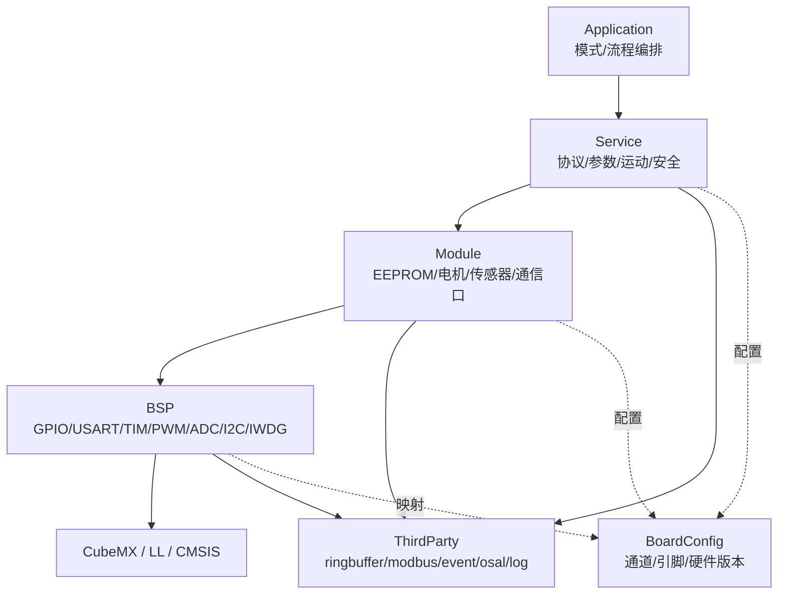

# 软件架构工程文档

返回：[工程文档总入口](about.md)

本文档描述通用阀门驱动平台的软件架构基线。详细执行步骤以 [about.md](about.md) 为准；各层接口细节见对应开发指南。

## 1. 目标与约束

项目目标：

- 支持两位阀和多位阀。
- 支持多协议，初期优先 Modbus RTU。
- 支持开环/闭环控制。
- 支持不同硬件板卡和后续 MCU 替换。
- 支持 Normal、Factory、Aging 三种模式，便于生产自动化。

关键指标：

- 通信实时性。
- 阀门错位重走和系统高可靠性。
- 代码易维护、易测试。
- 单元测试覆盖和 GitHub Actions 自动发布。

初始约束：

- STM32F103C8T6 / STM32F103xB，Flash/RAM 较小。
- CubeMX 生成 LL + CMake 工程。
- 板载 4KB EEPROM。
- 初期不强制 Bootloader 和 A/B 双分区。

## 2. 推荐技术栈

| 方向 | 推荐 | 说明 |
| --- | --- | --- |
| MCU 驱动 | STM32 LL | 比 HAL 更轻量，适合资源受限场景 |
| 构建 | CMake + Ninja | 负责 STM32 交叉编译和分层 target |
| 单元测试 | Ceedling + Unity + CMock | 负责 PC 端 C 单元测试和 mock |
| 覆盖率 | gcov/gcovr | 统计 PC 单元测试覆盖率 |
| 静态分析 | flawfinder、cppcheck、CodeQL | 在 CI 中逐步接入 |
| 发布 | GitHub Actions + GitHub Release | tag 触发自动固件发布 |
| 文档 | Markdown + Mermaid | 易维护、易审查 |

不建议初期引入完整 RTOS、复杂 Bootloader、完整 printf 日志体系或 MCU 端 JSON 解析。资源更大或需求成熟后再演进。

## 3. 总体架构

固定为 **4 个自有代码层 + CubeMX 生成区**：

```text
Application -> Service -> Module -> BSP -> CubeMX/LL/CMSIS
```

`BoardConfig` 和 `ThirdParty` 是辅助域：



## 4. 分层边界

| 层 | 做什么 | 不做什么 |
| --- | --- | --- |
| Application | 模式切换、主循环任务编排、应用级守护 | 不直接操作硬件，不解析底层协议帧 |
| Service | 协议、参数、运动、安全、故障策略 | 不直接调用 BSP/LL/HAL |
| Module | EEPROM、电机驱动、传感器、通信口适配 | 不写协议、阀门模型、安全策略 |
| BSP | MCU 外设能力封装 | 不出现 EEPROM、阀门、STEP/DIR/EN 等器件或业务语义 |
| BoardConfig | 多板卡静态配置 | 不写 LL 初始化和运行时状态 |
| ThirdParty | 外部库 | 不套用项目命名规则 |

核心依赖规则：

```text
Application 的模式/业务文件只依赖 Service
Application 的组合根 app.c/app_system.c 可编排初始化顺序
Service 只依赖 Module 和纯软件 ThirdParty
Module 只依赖 BSP、BoardConfig 和必要 ThirdParty
BSP 只依赖 CubeMX/LL/CMSIS、BoardConfig 和必要 ThirdParty
```

`app.c/app_system.c` 是组合根，允许调用 `bsp_Init()`、`mod_xxx_Init()`、`svc_xxx_Init()` 来固定初始化顺序，但不写业务逻辑。早期 Bring-up 允许用 `APP_ENABLE_BRINGUP` 隔离少量短路径，例如 `app_bringup.c` 直接调用 BSP 做 LED 闪烁、USART echo、IWDG 基础验证。Release 正式功能仍必须遵守上面的依赖规则。

## 5. 运行模型

初期采用裸机事件循环：

```text
main.c
  -> app_Init()
      -> app_system_Init()
          -> bsp_Init()
          -> mod_xxx_Init()
          -> svc_system_Init()
  -> while (1)
      -> app_MainLoop()
          -> svc_system_Poll()
          -> app_mode_Poll()
          -> app_guardian_Poll()
```

中断只做有限交接：

```text
USART/DMA/EXTI/TIM event -> 写 ringbuffer 或置位事件 -> 主循环解析和调度
```

这样可以在不引入 RTOS 的情况下保持通信实时性和调试简单度。后续引入 FreeRTOS/RT-Thread 时，优先把 `Poll` 迁移为任务，接口不大改。

通信实时性约束：

- Modbus RTU 帧边界不能只依赖 1ms `Poll()`。
- 优先用 USART IDLE、定时器或接收时间戳判断 3.5 字符间隔。
- RS485 发送方向控制必须等待 `TC` 发送完成后再释放 DE。
- 中断和 DMA 回调只做收字节、记时间、写 ringbuffer、置事件标志。

## 6. 参数与存储

参数优先保存到外部 EEPROM：

| 存储 | 内容 |
| --- | --- |
| EEPROM | 通道数、半通道、地址、波特率、速度、校准值、工厂信息、老化摘要 |
| Flash | 固件、默认参数、版本字符串 |
| RAM | shadow 参数、通信缓存、事件队列 |

EEPROM 数据建议带：

```text
magic / version / sequence / length / crc
```

写入策略：

```text
上位机 JSON -> Modbus/生产协议 -> RAM shadow -> 显式保存 EEPROM -> 重启回读校验
```

MCU 不直接解析 JSON/INI。

## 7. 运动与可靠性

42 步进电机 STEP 脉冲使用 TIM/PWM 生成：

```text
Service: 目标位置、距离/速度换算、运动状态机
Module: STEP/DIR/EN 驱动适配、脉冲计数、到步停止、急停快速关断
BSP: TIM/PWM/GPIO 原语
```

目标步数停止、光感急停和 PWM 输出关闭应尽量在 Module/BSP 快速路径完成；Service 负责目标、策略和故障判断，不做微秒级脉冲控制。

可靠性链路：

```text
svc_motion: 运动状态和目标
svc_safety: 急停、超时、错位重走、故障保持
app_guardian: 应用级降级和喂狗条件
```

故障策略原则：

- 不无限重试。
- 未知位置不继续危险动作。
- 故障码可通过协议读取。
- 故障清除必须有明确条件。

## 8. 测试与 CI/CD

测试优先级：

1. Service 纯软件逻辑：协议、参数、运动、安全。
2. Module 可 mock 的器件驱动：EEPROM、步进驱动、传感器。
3. Application 模式切换和守护逻辑。
4. BSP 通过代码审查、示波器和 HIL 验证。

测试工具落地顺序：先用 Unity + 手写 fake 跑通最小测试，再接入 Ceedling，最后再引入 CMock 和覆盖率门槛。

CI 必须逐步包含：

```text
CMake Debug/Release build
clang-format check
static analysis
Ceedling unit test
coverage report
tag release artifacts
```

发布版本以 Git tag 为唯一来源。固件版本头文件由 CMake 自动生成，不手写散落版本宏。

## 9. 演进方向

短期固定架构，不中途换层：

- 完成分层 target 和最小闭环。
- 完成 EEPROM 参数、Modbus 写参、步进驱动、急停。
- 完成三种运行模式。
- 完成 Ceedling 和 CI Release。

中期小步演进：

- USART RXNE 升级为 DMA + IDLE。
- 恒速步进升级为梯形加减速。
- 覆盖率从观察升级为门槛。
- 加入 HIL。

长期演进：

- CAN。
- FreeRTOS/RT-Thread。
- Bootloader + A/B 双分区。
- 国产 MCU 或更大容量 MCU。

## 10. 验收标准

- `main.c` 中不堆业务逻辑。
- Application 的模式/业务文件不直接调用 Module/BSP；`app_system.c` 初始化例外。
- Service 不直接调用 BSP/LL/HAL。
- Module 不直接调用 LL/HAL。
- BSP public header 不暴露 STM32 LL/HAL 类型。
- EEPROM 和电机驱动在 Module，不在 BSP。
- 核心 Service 有单元测试。
- CI 可自动构建、测试、覆盖率统计和 tag 发布。

## 11. 关联文档

- [Application 开发指南](application_development_guide.md)
- [Service 开发指南](service_development_guide.md)
- [Module 开发指南](module_development_guide.md)
- [BSP 开发指南](bsp_development_guide.md)
- [BoardConfig 开发指南](boardconfig_development_guide.md)
- [ThirdParty 管理指南](thirdparty_management_guide.md)
- [软件版本与发布管理指南](software_version_release_guide.md)
