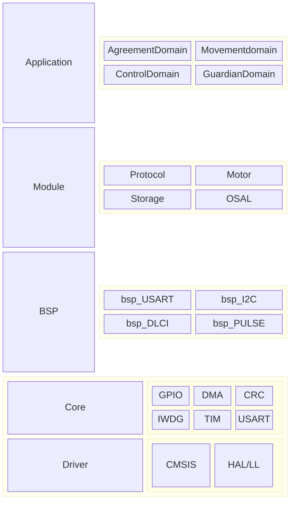

# nextG universal valve drive platform
下世代通用阀门驱动平台

# Architecture Design

## Application
### AgreementDomain
协议域
### Movementdomain
运动域
### ControlDomain
控制域
### GuardianDomain
守护域
## Module
### Protocol
协议解析
### Motor
运动控制
### Storage
存储
### OSAL
简单线程调度
## BSP
### bsp_USART
串口
### bsp_I2C
软IIC
### bsp_DLCI
数字逻辑控制接口
### bsp_PULSE
脉冲生成
## Cube
### CMSIS
### HAL/LL
