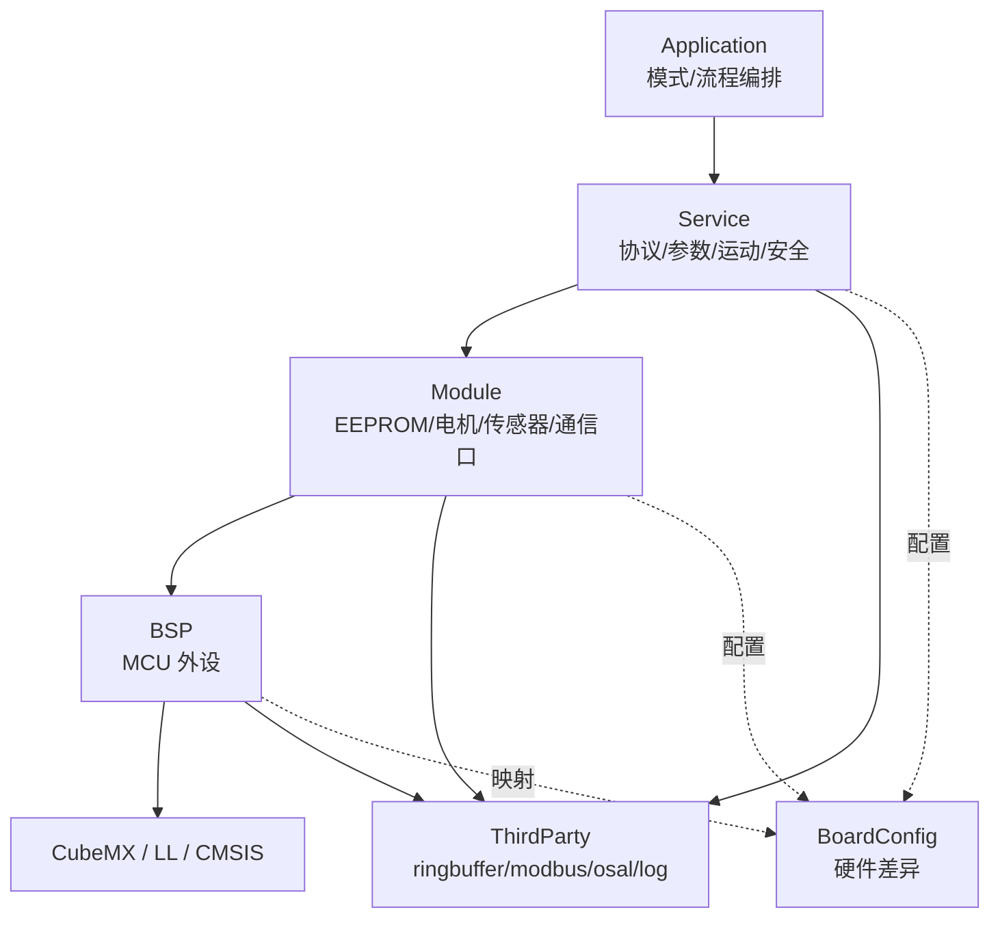

# nextG universal valve drive platform

下世代通用阀门驱动平台。

[](https://github.com/zym787/nextG_universal_valve_drive_platform/actions/workflows/build.yml)
[](https://github.com/zym787/nextG_universal_valve_drive_platform/actions/workflows/github-code-scanning/codeql)
[](https://github.com/zym787/nextG_universal_valve_drive_platform/actions/workflows/flawfinder.yml)

## 项目目标

本项目用于设计一套面向下世代通用阀门的驱动平台，目标支持两位阀/多位阀、多协议、开环/闭环控制、多硬件板卡，并支持工厂模式、老化模式和正常模式。

核心指标：

- 通信实时性。
- 阀门错位重走和系统高可靠性。
- 代码易维护、易测试、易发布。
- GitHub Actions 自动构建、测试、覆盖率和版本发布。

## 硬件与工程基线

- MCU：STM32F103C8T6 / STM32F103xB。
- 工程：STM32CubeMX 生成 LL 库代码和 CMake 工程。
- 存储：板载 4KB EEPROM 保存设备参数、工厂配置和少量运行统计。
- 资源：Flash/RAM 较小，初期不强制 Bootloader 和 A/B 双分区。
- 电机：42 步进电机 STEP 脉冲使用硬件定时器/PWM，不使用软件延时模拟。

## 架构

项目固定为 **4 个自有代码层 + CubeMX 生成区**：

```text
Application -> Service -> Module -> BSP -> CubeMX/LL/CMSIS
```



关键边界：

- Application 只调用 Service。
- Service 负责协议、参数、运动、安全，不直接调用 BSP/LL/HAL。
- Module 负责板上器件和硬件模块，例如 EEPROM、步进驱动、传感器、通信口。
- BSP 只封装 MCU 外设，例如 GPIO、USART、TIM、PWM、ADC、IWDG、I2C。
- BoardConfig 管理板卡差异；ThirdParty 保持上游源码命名。

## 目录规划

```text
Application/      应用入口、模式管理、任务编排
Service/          协议、参数、运动、安全等系统能力
Module/           EEPROM、电机驱动、传感器、通信口适配
BSP/              MCU 外设封装
BoardConfig/      硬件版本和通道/引脚配置
ThirdParty/       ringbuffer、event、modbus、osal、log 等外部组件
Core/             CubeMX 生成区
Drivers/          CubeMX / STM32 包
cmake/stm32cubemx CubeMX 生成 CMake
Doc/              工程文档
```

## 命名规则

命名规则只约束项目自有代码，不修改 CubeMX 生成代码，也不修改 ThirdParty 原始源码。

| 区域 | 文件/函数/类型前缀 | 宏/枚举前缀 |
| --- | --- | --- |
| Application | `app_` | `APP_` |
| Service | `svc_` | `SVC_` |
| Module | `mod_` | `MOD_` |
| BSP | `bsp_` | `BSP_` |

文件名使用小写下划线，例如 `svc_motion.c`、`mod_eeprom.c`、`bsp_usart.c`。

## 参数与生产流程

设备参数优先保存到外部 EEPROM，不优先写片内 Flash。生产配置文件建议使用 JSON，但 JSON 只由上位机解析；MCU 内部保存紧凑二进制结构，并带版本、长度、序号和 CRC。

推荐生产流程：

```text
烧录固件 -> 进入工厂模式 -> 上位机导入 JSON -> 写入参数 -> 保存 EEPROM
-> 重启回读校验 -> 功能测试 -> 老化测试 -> 切换正常模式 -> 生成生产报告
```

## 版本与发布

软件版本以 Git tag 为唯一来源，格式为：

```text
vMAJOR.MINOR.PATCH
```

CMake 根据 Git tag、commit、`BOARD_HW`、构建时间生成 `app_version.h`。GitHub Actions 在 tag 发布时自动生成带版本和硬件版本的 `.elf`、`.hex`、`.bin`、`.map`、`firmware-info` 和 `sha256sums`。

## 重大节点

- [ ] 固定 CubeMX LL + CMake 基线工程，并建立分层 CMake target。
- [ ] 完成 BoardConfig、BSP、Module、Service、Application 的最小可运行闭环。
- [ ] 完成 EEPROM 参数保存、Modbus 工厂写参和版本读取。
- [ ] 完成 42 步进电机定时器/PWM 脉冲驱动和光感急停。
- [ ] 完成 Normal / Factory / Aging 三种运行模式。
- [ ] 引入 Ceedling 单元测试、覆盖率和 GitHub Actions 自动测试。
- [ ] 建立 tag 自动发布固件产物。
- [ ] 后续评估 HIL、CAN、RTOS、Bootloader + A/B 双分区和国产 MCU 适配。

## 文档

详细设计、执行步骤和 TODO 统一从 [工程文档总入口](Doc/about.md) 阅读。
