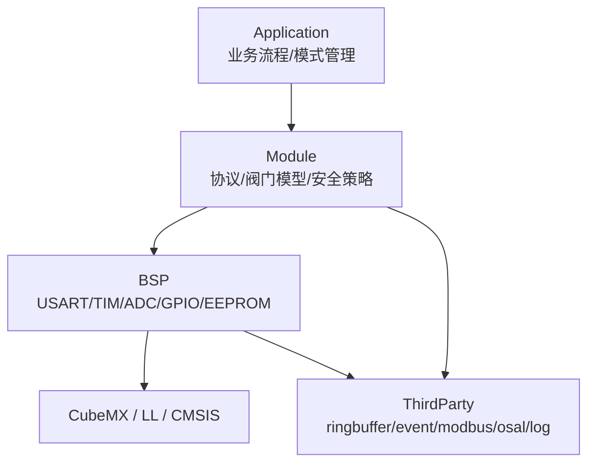

# nextG universal valve drive platform

下世代通用阀门驱动平台。

[](https://github.com/zym787/nextG_universal_valve_drive_platform/actions/workflows/build.yml)
[](https://github.com/zym787/nextG_universal_valve_drive_platform/actions/workflows/github-code-scanning/codeql)
[](https://github.com/zym787/nextG_universal_valve_drive_platform/actions/workflows/flawfinder.yml)

## Project Goal

本项目用于设计一套通用阀门驱动平台，目标支持：

- 两位阀和多位阀。
- 多通信协议，初期建议优先支持 Modbus RTU。
- 开环控制和闭环控制。
- 不同驱动电路、传感器和后续硬件平台。
- 工厂模式、老化模式、正常模式，便于生产全流程自动化。

核心指标：

- 通信实时性。
- 阀门错位重走和系统高可靠性。
- 代码易维护。
- 单元测试覆盖。
- GitHub Actions 自动构建、测试、覆盖率和发布。

## Hardware Assumptions

- MCU：STM32F103C8T6 / STM32F103xB。
- 工程：STM32CubeMX 生成 LL 库代码和 CMake 工程。
- 存储：板载 4KB EEPROM 用于保存设备参数、工厂配置和少量运行统计。
- Flash/RAM 较小，初期不强制实现 Bootloader 和 A/B 双分区。

参数存储建议：

- EEPROM：通道数、半通道、地址、波特率、速度、校准值、工厂配置、老化统计摘要。
- Flash：固件程序、只读默认参数、版本信息。
- RAM：运行时 shadow 参数、通信缓存、事件队列。

## Architecture



依赖方向固定为：

```text
Application -> Module -> BSP -> CubeMX/LL/CMSIS
```

约束：

- Application 不直接调用 BSP、HAL、LL。
- Module 不直接调用 HAL、LL。
- BSP 可以调用 CubeMX 生成函数和 STM32 LL。
- ThirdParty 保持上游源码命名，不套用项目命名规则。

## Architecture Baseline

当前项目处于规划阶段，但硬件资源有限、团队工程化经验仍在建立。为避免中途反复切换架构，以下方向作为阶段性基线固定下来：

- 固件采用裸机事件循环，不在初期引入完整 RTOS。
- 架构固定为 `Application -> Module -> BSP -> CubeMX/LL/CMSIS`。
- CMake 负责 STM32 固件构建，Ceedling 负责 PC 单元测试。
- 参数优先保存到板载 EEPROM，不优先写片内 Flash。
- 42 步进电机 STEP 脉冲由硬件定时器生成，不使用软件延时模拟。
- MCU 端不解析 JSON/INI；JSON 只用于上位机和产线工具。

允许后续小步演进，例如串口 RXNE 升级 DMA + IDLE、恒速步进升级梯形加减速、覆盖率从观察升级为门槛。除非硬件或关键指标无法满足，不做中途大换型。

## Directory Plan

```text
Application/
  Inc/
  Src/
  CMakeLists.txt

Module/
  Inc/
  Src/
  CMakeLists.txt

BSP/
  Inc/
  Src/
  CMakeLists.txt

ThirdParty/
  ringbuffer/
  event/
  modbus/
  osal/
  log/
  CMakeLists.txt

Core/                 CubeMX generated
Drivers/              CubeMX / STM32 packages
cmake/stm32cubemx/    CubeMX generated CMake
Doc/                  engineering documents
```

## Naming Rules

命名规则只约束项目自有代码：`Application`、`Module`、`BSP`。不修改 CubeMX 生成代码，不修改 `ThirdParty` 原始源码。

| 层级 | 文件/函数/类型前缀 | 宏/枚举前缀 |
| --- | --- | --- |
| Application | `app_` | `APP_` |
| Module | `mod_` | `MOD_` |
| BSP | `bsp_` | `BSP_` |

示例：

```c
void app_Init(void);
void app_MainLoop(void);

int mod_protocol_Poll(void);
int mod_valve_SetTargetPosition(uint8_t position);

int bsp_usart_Send(const uint8_t *data, uint16_t len);
int bsp_eeprom_Read(uint16_t address, uint8_t *data, uint16_t len);
```

文件名使用小写下划线：

```text
app_control.c
mod_valve.c
bsp_usart.c
bsp_eeprom.c
```

## Operating Modes

系统支持三种模式：

- Normal Mode：正常模式，客户现场运行。
- Factory Mode：工厂模式，用于写参、校准、单通道测试、保存 EEPROM。
- Aging Mode：老化模式，用于自动循环动作、统计失败次数、错位次数、重走次数和最大动作时间。

推荐生产流程：

```text
烧录固件
  -> 默认通信连接
  -> 进入工厂模式
  -> 上位机读取 JSON 配置
  -> 通过 Modbus/生产协议写入参数
  -> 保存到 EEPROM
  -> 重启并回读校验
  -> 功能测试
  -> 老化测试
  -> 生成生产报告
  -> 切换正常模式
```

说明：JSON 文件只建议在上位机侧使用，MCU 端不直接解析 JSON/INI。设备内部使用 EEPROM 中的紧凑二进制结构，并带版本、长度、序号和 CRC。

## ThirdParty

必须或建议集成的组件：

- ringbuffer：环形队列，用于串口接收、协议输入和日志缓冲。
- event/message：消息或事件通知，用于协议命令、阀门到位、错位、故障等事件。
- modbus：建议优先支持 Modbus RTU slave。
- osal：Operating System Abstraction Layer，简单裸机调度和事件抽象。
- log：轻量日志，Release 下可裁剪。

管理建议：

- 小型稳定库直接 vendor 到 `ThirdParty`。
- Modbus 可先 vendor 固定版本，后续稳定后再考虑 git submodule。
- ThirdParty 原始文件和函数保持上游命名。

## TODO

### Phase 0: Project Baseline

- [ ] 确认 CubeMX 生成的 LL + CMake 工程 Debug/Release 均可编译。
- [ ] 保持 `Core/`、`Drivers/`、`cmake/stm32cubemx/` 为 CubeMX 生成区，不放业务逻辑。
- [ ] 建立 `Application`、`Module`、`BSP`、`ThirdParty` 的 `CMakeLists.txt`。
- [ ] 在 `main.c` 的 USER CODE 区域只保留 `app_Init()` 和 `app_MainLoop()` 调用。

### Phase 1: Basic BSP

- [ ] 实现 `bsp_usart`：串口收发、接收中断或 DMA、环形缓冲接入。
- [ ] 实现 `bsp_gpio`：输入输出封装、光感输入读取。
- [ ] 实现 `bsp_timer`：系统 tick、微秒/毫秒计时。
- [ ] 实现 `bsp_pwm` 或 `bsp_stepper_pulse`：基于定时器输出步进电机 STEP 脉冲。
- [ ] 实现 `bsp_eeprom`：4KB EEPROM 读写、页边界处理、写入校验。
- [ ] 实现 `bsp_watchdog`：看门狗初始化和喂狗。

### Phase 2: Stepper Motor Control

- [ ] 建立 `mod_motor`，封装 42 步进电机的距离、速度、方向、启停控制。
- [ ] 使用硬件定时器生成 STEP 脉冲，不使用软件延时模拟脉冲。
- [ ] 支持指定距离运动：距离换算为步数，按目标步数停止。
- [ ] 支持速度参数：定时器周期决定脉冲频率。
- [ ] 支持光感急停：光感触发后立即停止定时器输出并上报事件。
- [ ] 支持超时、错位重走、故障保持。

### Phase 3: Protocol And Parameters

- [ ] 集成 ringbuffer。
- [ ] 集成 Modbus RTU slave，优先用于工厂写参和状态读取。
- [ ] 建立 `mod_protocol`，实现协议解析、命令分发、响应封包。
- [ ] 建立 EEPROM 参数结构：`magic/version/sequence/length/crc`。
- [ ] 支持上位机读取 JSON 配置后，通过 Modbus/生产协议写入设备参数。
- [ ] 参数保存采用 RAM shadow + 显式保存 EEPROM + 重启回读校验。

### Phase 4: Operating Modes

- [ ] 实现 Normal Mode：正常运行，只开放安全命令。
- [ ] 实现 Factory Mode：写参、校准、单通道动作测试、保存 EEPROM。
- [ ] 实现 Aging Mode：自动循环动作、统计成功/失败/重走/错位/最大动作时间。
- [ ] 工厂模式进入需要授权，老化模式只能从工厂模式进入。
- [ ] 上位机可读取工厂测试结果和老化报告。

### Phase 5: Unit Test And CI

- [ ] 引入 Ceedling，统一管理 Unity/CMock/gcov。
- [ ] 建立 PC 单元测试目录和第一个 ringbuffer 测试。
- [ ] 为 `mod_protocol` 增加协议解析测试。
- [ ] 为 `mod_motor` 增加距离换算、速度参数、急停状态机测试。
- [ ] 为 `mod_safety` 增加错位重走和故障保持测试。
- [ ] GitHub Actions 增加单元测试 job。
- [ ] GitHub Actions 生成覆盖率报告。

### Phase 6: Release Automation

- [ ] tag 触发 Release 构建。
- [ ] 自动上传 `.elf`、`.hex`、`.bin`、`.map`。
- [ ] 自动生成 `firmware-info.txt`，包含版本、commit、构建时间和固件大小。
- [ ] 发布前必须通过编译、静态分析、单元测试。
- [ ] 后续接入 HIL 硬件在环测试，用于发布前自动验证真实板卡。

## Terms

- BSP：Board Support Package，板级支持包，封装 MCU 外设和板级硬件访问。
- OSAL：Operating System Abstraction Layer，操作系统抽象层，本项目初期指裸机轻量调度。
- Ceedling：C 语言单元测试构建工具，集成 Unity、CMock 和覆盖率支持。
- Fake BSP：测试用假的 BSP，在 PC 单元测试中模拟硬件接口。
- Mock：测试替身，用于验证函数调用和参数。
- HIL：Hardware In the Loop，硬件在环测试，自动连接真实板卡验证。
- Vendor：把第三方源码直接放入本仓库。
- git submodule：Git 子模块，用独立仓库管理第三方依赖。

## Documents

详细设计见：

- [软件架构工程文档](Doc/software_architecture_valve_drive_platform.md)
- [CMake 与 CI/CD 演进方案](Doc/architecture_cmake_ci_evolution_plan.md)
